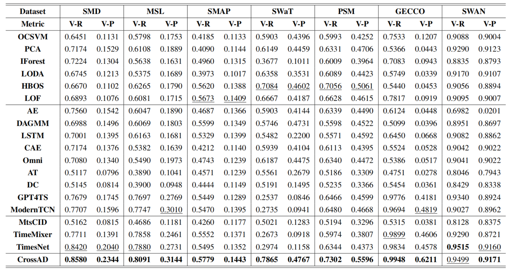

```
.
|-- configs
|   |-- GECCO
|   |-- MSL
|   |-- PSM
|   |-- SMAP
|   |-- SMD
|   |-- SWAN
|   |-- SWAT
|   `-- UCR
|-- data_provider
|   |-- __init__.py
|   |-- data_provider.py
|   `-- data_provider_UCR.py
|-- dataset
|   |-- DETECT_META.csv
|   |-- UCR_Anomaly_FullData
|   `-- data
|-- exp
|   `-- exp_anomaly_detection.py
|-- models
|   `-- CrossAD
|-- run.py
|-- run_UCR.py
|-- scripts
|   |-- test
|   `-- train
|-- test_results
|   |-- GECCO
|   |-- MSL
|   |-- PSM
|   |-- SMAP
|   |-- SMD
|   |-- SWAN
|   |-- SWAT
|   `-- UCR
`-- ts_ad_evaluation
    |-- __init__.py
    |-- accomplish_UCR
    |-- affiliation
    |-- auc_vus
    |-- evaluator.py
    |-- f1
    |-- pate
    `-- spot.py
```

# Quickstart
## Data preparation
Prepare Data. You can obtained the well pre-processed datasets at https://drive.google.com/file/d/1YU_d9kIaP2EubyUhGWOwSKAhJxNntB8W/view?usp=sharing. 
Then place the downloaded data under the folder ```./dataset/```.
```
dataset
|   |-- DETECT_META.csv
|   |-- UCR_Anomaly_FullData
|   `-- data
```
## Train and evaluate model
1. The model structure of **CrossAD** under the folder ```./models/CrossAD/```
2. We provide the scripts for CrossAD under the folder ```./scripts/```. For example you can reproduce a experiment result as the following:
```bash
sh ./scripts/test/GECCO.sh
```
If there is no model weight, please execute the following script:
```bash
sh ./scripts/train/GECCO.sh
```
## Results
Results in the seven real-world datasets. The V-R and V-P are the VUS-ROC and VUS-PR, that higher indicate better performance. The best ones are in **bold**, and the second ones are underlined.



